# UD7 – El lenguaje SQL: Manipulación de Datos y Gestión de Transacciones

Para esta práctica estaremos trabajando con el modelo de ejemplo de oracle Order Entry.

Las tablas originales del esquema `OE` no se modifican directamente; en su lugar se trabaja con las copias que voy a crear acontinuación (`productos_u4` e `inventario_u4`).

---

## Paso 1 – Espejo de Datos

Antes de comenzar cualquier operación DML, se crean copias de las tablas originales del esquema `OE` para no alterar los datos maestros:

```sql
CREATE TABLE productos_u4  AS SELECT * FROM OE.PRODUCT_INFORMATION;
CREATE TABLE inventario_u4 AS SELECT * FROM OE.INVENTORIES;
```

Estas tablas heredan la estructura y los datos de las originales, pero **no las restricciones de integridad referencial** (claves foráneas).

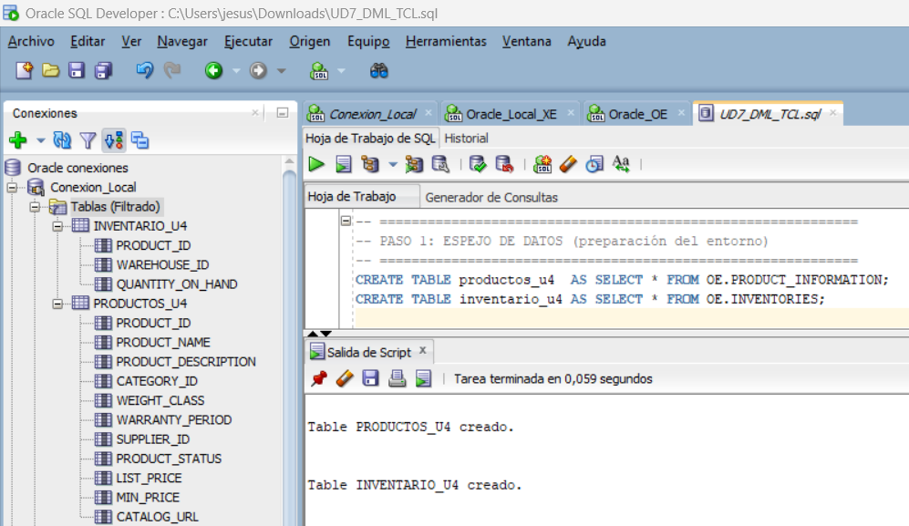

---


## Paso 2 – Bloque de Inserción (INSERT)

La sentencia `INSERT` permite añadir nuevas filas a una tabla. Se han practicado diez variantes distintas de inserción.

### 2.1 – Simple

Inserción directa especificando solo las columnas necesarias:

```sql
INSERT INTO productos_u4 (product_id, product_name, list_price)
VALUES (7000, 'Cable HDMI 2.1', 25);
```

Las columnas no indicadas reciben `NULL` automáticamente si no tienen valor por defecto.

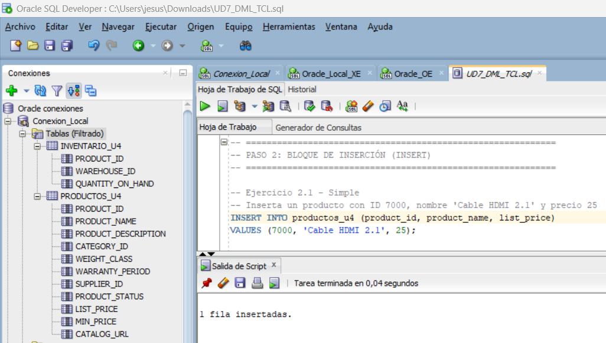


### 2.2 – Columnas específicas

Se pueden omitir columnas opcionales. Oracle asignará `NULL` a las no incluidas:

```sql
INSERT INTO productos_u4 (product_id, product_name, category_id)
VALUES (7001, 'Hub USB-C', 10);
```

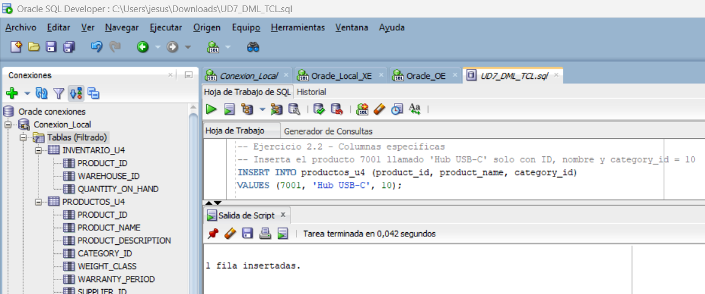


### 2.3 – Uso de Nulos

Se insertan todos los campos explícitamente, dejando `warranty_period` como `NULL`:

```sql
INSERT INTO productos_u4 (
    product_id, product_name, product_description, category_id,
    weight_class, warranty_period, supplier_id, product_status,
    list_price, min_price, catalog_url
)
VALUES (
    7002, 'Teclado Mecánico', 'Teclado mecánico retroiluminado RGB', 10,
    1, NULL, 102, 'orderable', 89.99, 45.00, 'http://catalog.example.com/7002'
);
```

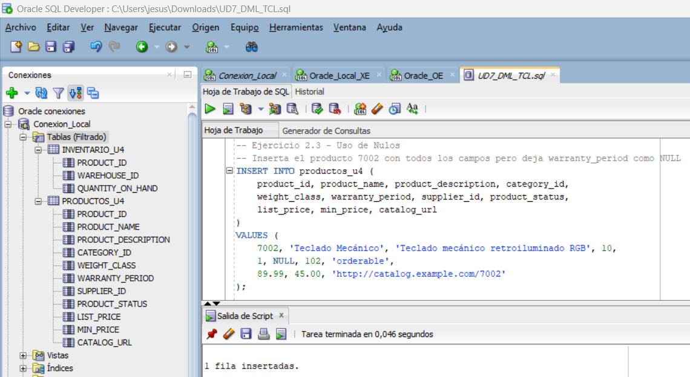


### 2.4 – Sintaxis de Fecha con SYSDATE

Se crea una tabla de log y se registra la fecha actual usando la función `SYSDATE`:

```sql
CREATE TABLE log_pedidos (
    log_id      NUMBER PRIMARY KEY,
    descripcion VARCHAR2(200),
    fecha_log   DATE
);

INSERT INTO log_pedidos (log_id, descripcion, fecha_log)
VALUES (1, 'Registro de prueba con SYSDATE', SYSDATE);
```

`SYSDATE` devuelve la fecha y hora actuales del servidor Oracle.

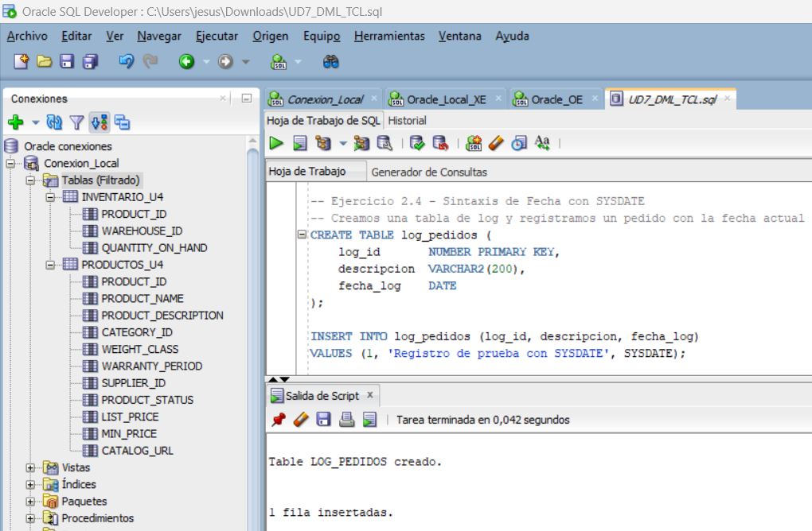


### 2.5 – Copia de fila

Se inserta una copia exacta del producto 1797 con un ID diferente mediante una subconsulta:

```sql
INSERT INTO productos_u4
SELECT 7003, product_name, product_description, category_id,
       weight_class, warranty_period, supplier_id, product_status,
       list_price, min_price, catalog_url
FROM OE.PRODUCT_INFORMATION
WHERE product_id = 1797;
```

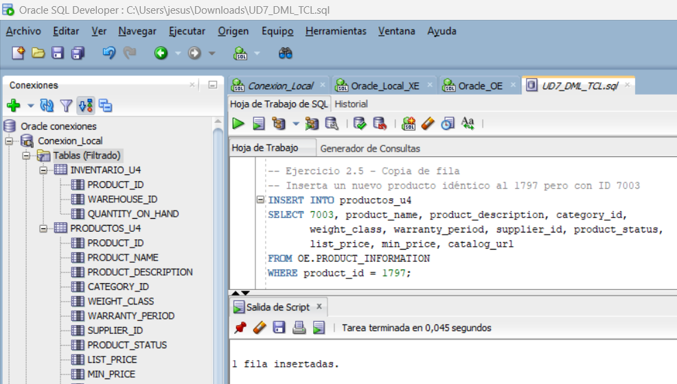


### 2.6 – Inserción Masiva

Se insertan múltiples filas en una sola sentencia usando `INSERT ... SELECT`. El filtro `NOT IN` evita duplicados:

```sql
INSERT INTO productos_u4
SELECT *
FROM OE.PRODUCT_INFORMATION
WHERE list_price > 5000
  AND product_id NOT IN (SELECT product_id FROM productos_u4);
```

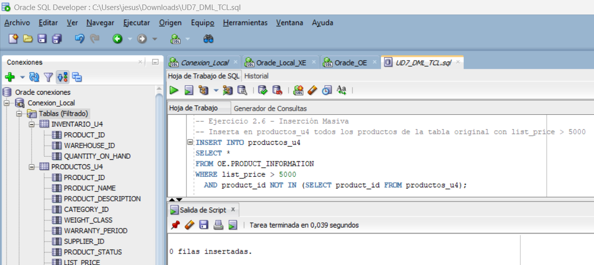


### 2.7 – Subconsulta con Filtro

Inserta productos de la categoría 11 que todavía no existen en la tabla destino:

```sql
INSERT INTO productos_u4
SELECT *
FROM OE.PRODUCT_INFORMATION
WHERE category_id = 11
  AND product_id NOT IN (SELECT product_id FROM productos_u4);
```

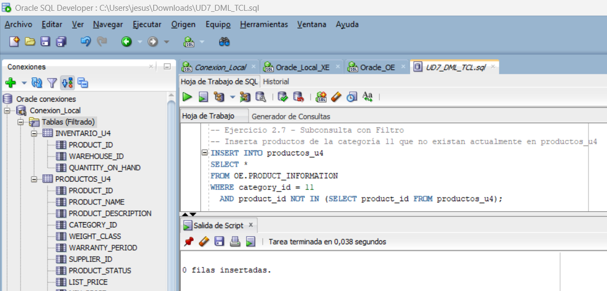


### 2.8 – Carga Parcial

Solo se insertan dos columnas (`product_id` y `product_name`) de los productos con stock en el almacén 1:

```sql
INSERT INTO productos_u4 (product_id, product_name)
SELECT DISTINCT pi.product_id, pi.product_name
FROM OE.PRODUCT_INFORMATION pi
WHERE pi.product_id IN (
    SELECT product_id FROM OE.INVENTORIES WHERE warehouse_id = 1
)
AND pi.product_id NOT IN (SELECT product_id FROM productos_u4);
```

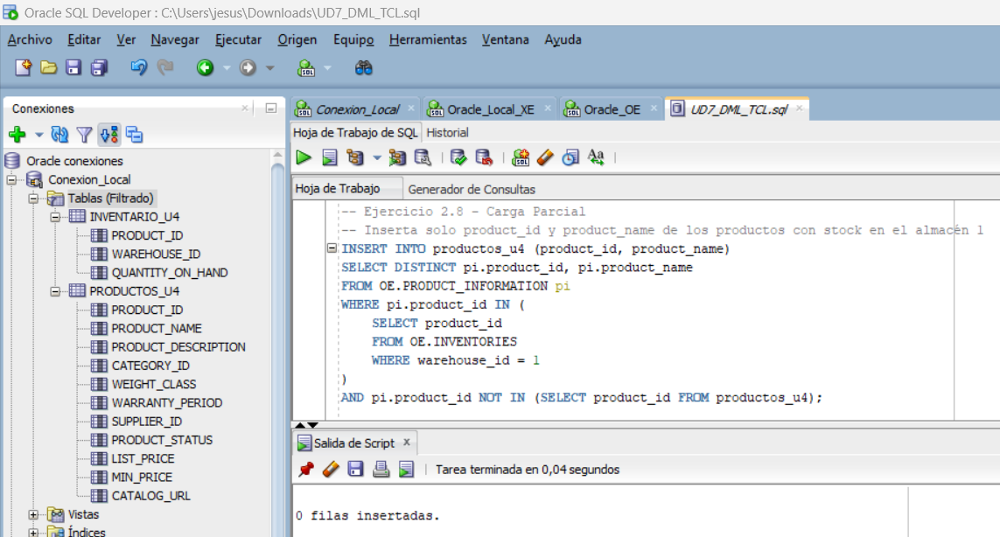


### 2.9 – Cálculo en Inserción

El valor de `list_price` se calcula dinámicamente como el doble del precio medio de la categoría 10:

```sql
INSERT INTO productos_u4 (product_id, product_name, category_id, list_price)
VALUES (
    7005,
    'Producto Calculado Cat10',
    10,
    (SELECT AVG(list_price) * 2 FROM OE.PRODUCT_INFORMATION WHERE category_id = 10)
);
```

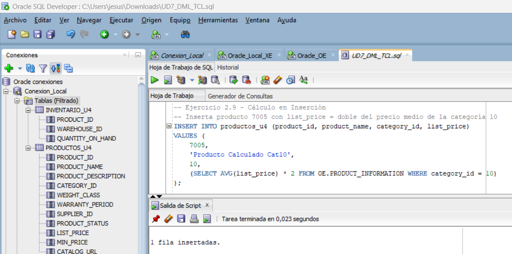


### 2.10 – Multitabla con SELECT

Se crea una tabla auxiliar `precios_altos` y se puebla con todos los productos cuyo precio supera 1000:

```sql
CREATE TABLE precios_altos AS
SELECT product_id, product_name, list_price
FROM productos_u4 WHERE 1 = 0;

INSERT INTO precios_altos (product_id, product_name, list_price)
SELECT product_id, product_name, list_price
FROM productos_u4
WHERE list_price > 1000;
```

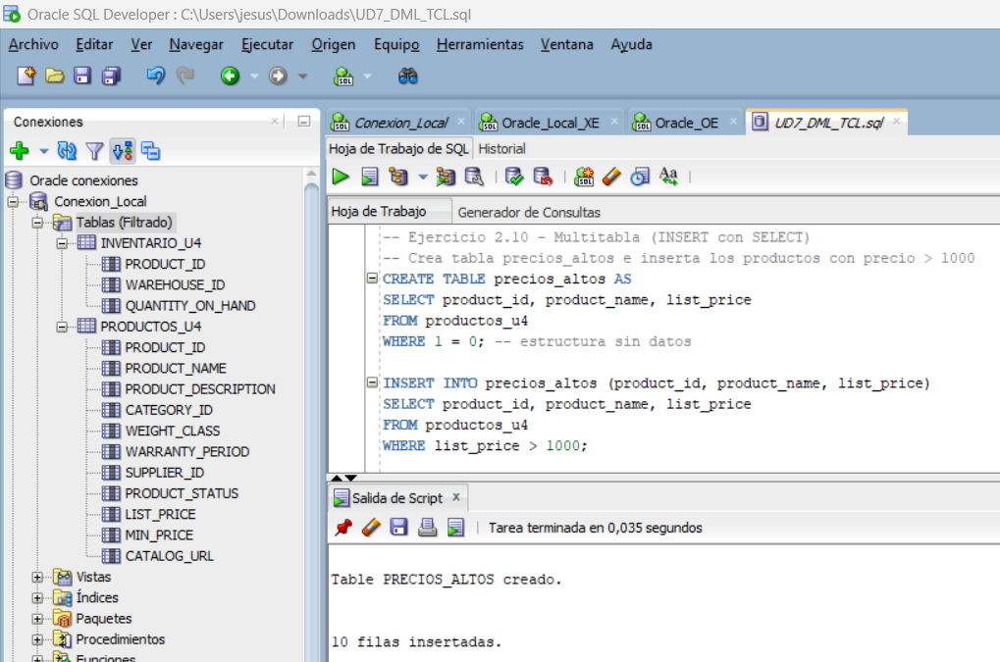

---


## Paso 3 – Bloque de Modificación (UPDATE)

La sentencia `UPDATE` modifica los valores de columnas en filas ya existentes. El uso de `WHERE` es crítico: sin él, el cambio afecta a **toda** la tabla.

### 3.1 – Directo

```sql
UPDATE productos_u4
SET product_status = 'obsolete'
WHERE product_id = 1797;
```

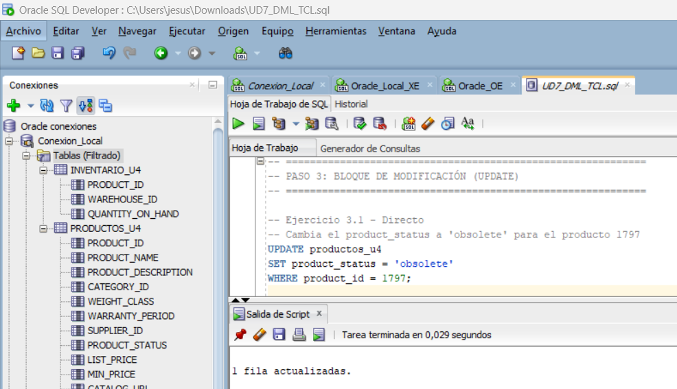


### 3.2 – Múltiples columnas

```sql
UPDATE productos_u4
SET min_price  = 50,
    list_price = 80
WHERE product_id = 7000;
```

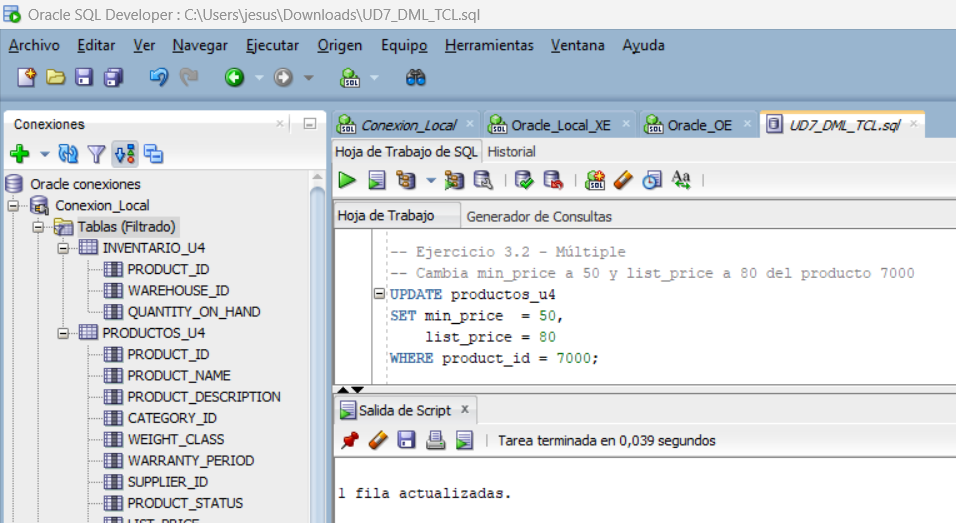


### 3.3 – Filtro Simple

```sql
UPDATE productos_u4
SET list_price = list_price + 10
WHERE category_id = 12;
```

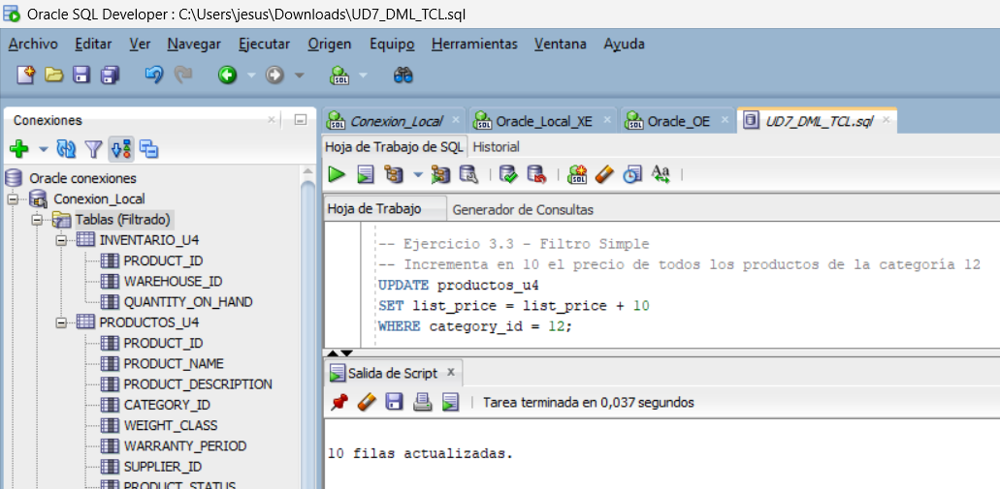


### 3.4 – Uso de LIKE

```sql
UPDATE productos_u4
SET product_status = 'discontinued'
WHERE product_name LIKE 'Software%';
```

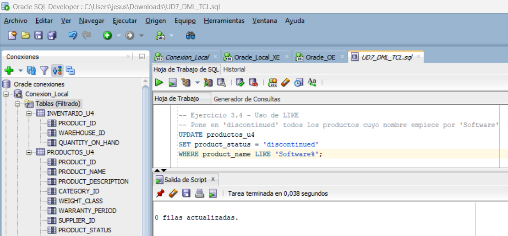


### 3.5 – Basado en NULL

```sql
UPDATE productos_u4
SET min_price = 5
WHERE min_price IS NULL;
```

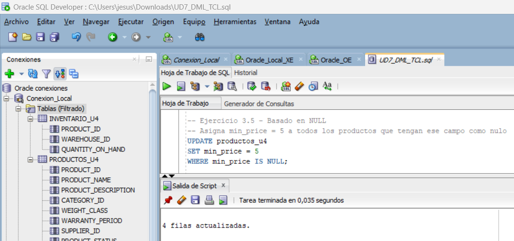


### 3.6 – Cálculo Porcentual

```sql
UPDATE productos_u4
SET list_price = list_price * 0.80
WHERE weight_class = 5;
```

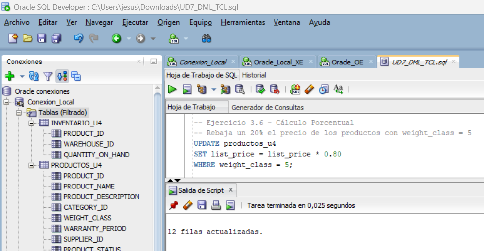


### 3.7 – Subconsulta Simple

El `category_id` se obtiene dinámicamente buscando el nombre de la categoría:

```sql
UPDATE productos_u4
SET list_price = list_price + 100
WHERE category_id = (
    SELECT category_id
    FROM OE.PRODUCT_CATEGORIES
    WHERE category_name = 'Software/Other'
);
```

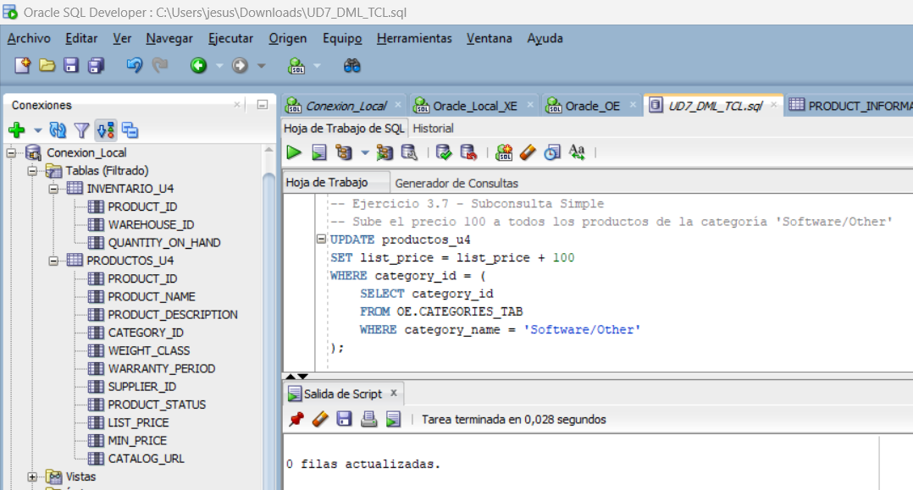


### 3.8 – Update Correlacionado

Actualiza `min_price` con el precio mínimo real registrado en los pedidos. Es un UPDATE correlacionado porque la subconsulta hace referencia a la tabla externa (`p.product_id`):

```sql
UPDATE productos_u4 p
SET p.min_price = (
    SELECT MIN(oi.unit_price)
    FROM OE.ORDER_ITEMS oi
    WHERE oi.product_id = p.product_id
)
WHERE EXISTS (
    SELECT 1 FROM OE.ORDER_ITEMS oi WHERE oi.product_id = p.product_id
);
```

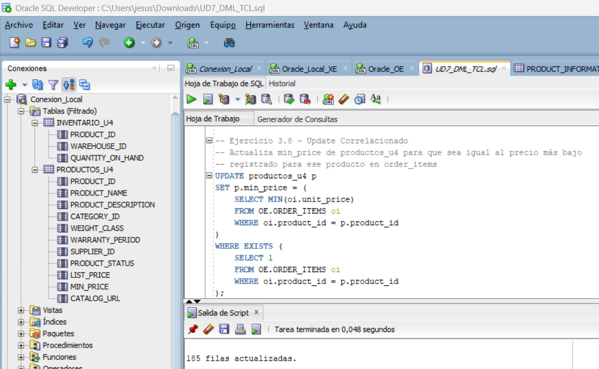


### 3.9 – Condición de Existencia

```sql
UPDATE productos_u4
SET product_status = 'available'
WHERE product_id IN (
    SELECT product_id FROM inventario_u4 WHERE quantity_on_hand >= 1
);
```

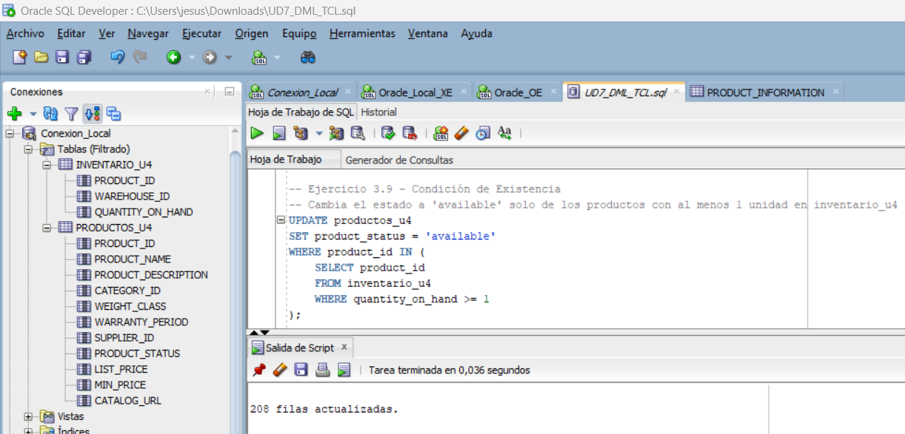


### 3.10 – Lógica Compleja

Solo se reducen los productos cuyo precio supera la media global:

```sql
UPDATE productos_u4
SET list_price = list_price * 0.95
WHERE list_price > (SELECT AVG(list_price) FROM productos_u4);
```

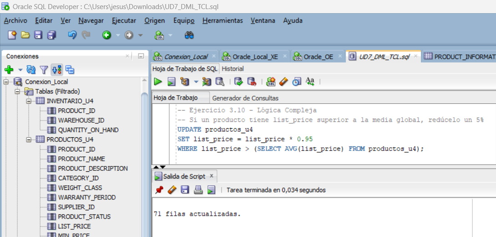

---


## Paso 4 – Bloque de Borrado (DELETE)

La sentencia `DELETE` elimina filas completas de una tabla. Al igual que `UPDATE`, **siempre debe incluir `WHERE`** salvo que se quiera vaciar la tabla entera.

### 4.1 – ID Específico

```sql
DELETE FROM productos_u4 WHERE product_id = 7000;
```

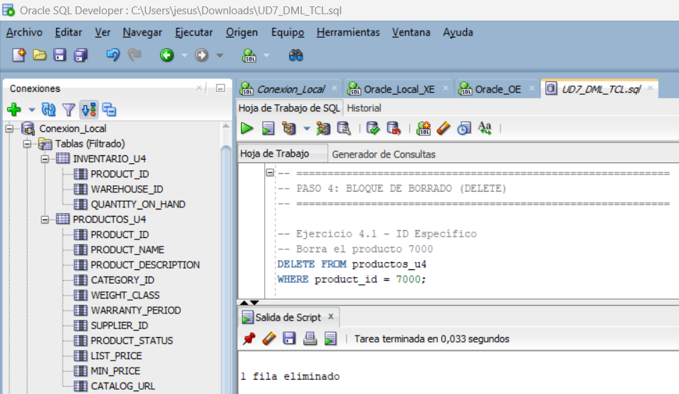


### 4.2 – Filtro de Texto

```sql
DELETE FROM productos_u4
WHERE product_description LIKE '%Test%';
```

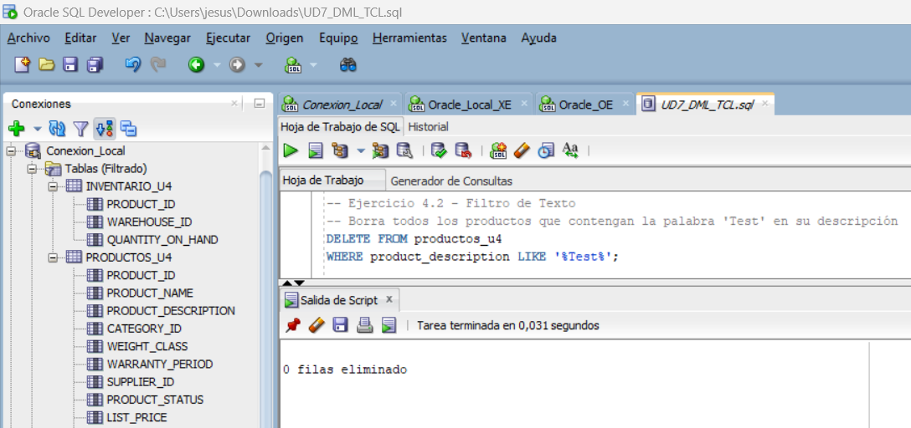


### 4.3 – Rango Numérico

```sql
DELETE FROM productos_u4
WHERE list_price BETWEEN 0 AND 1;
```

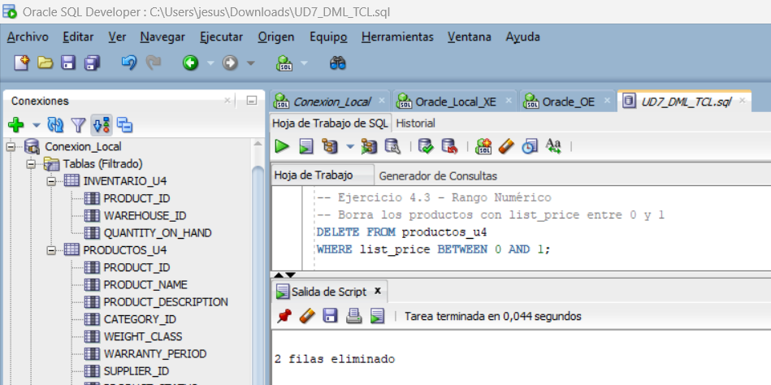


### 4.4 – Estado y Categoría

```sql
DELETE FROM productos_u4
WHERE category_id = 10
  AND product_status = 'under development';
```

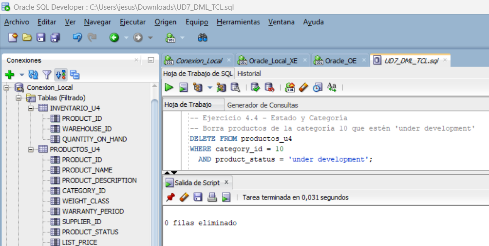


### 4.5 – Sin Inventario

Borra productos que no tienen ninguna entrada en la tabla de inventario:

```sql
DELETE FROM productos_u4
WHERE product_id NOT IN (
    SELECT DISTINCT product_id FROM inventario_u4
);
```

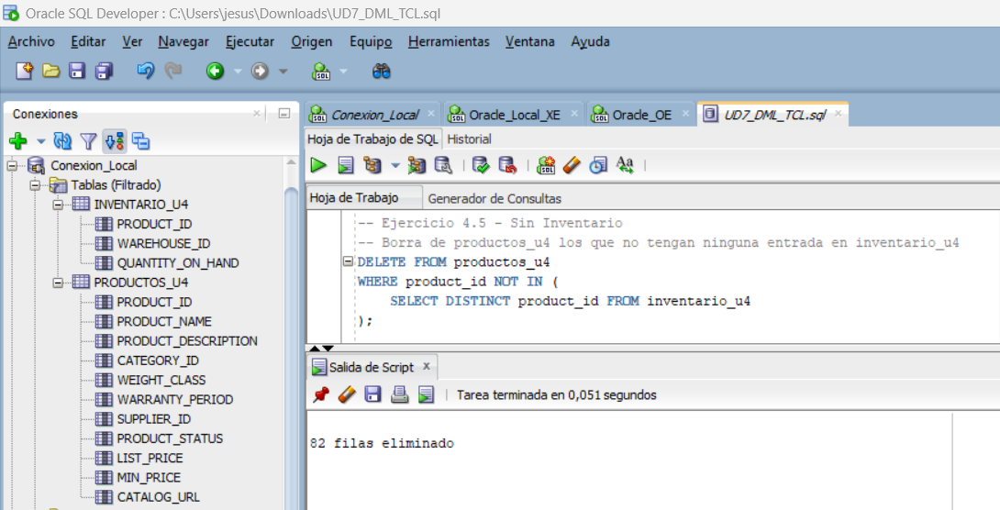


### 4.6 – Subconsulta de Agregación

```sql
DELETE FROM productos_u4
WHERE min_price = (SELECT MIN(min_price) FROM productos_u4);
```

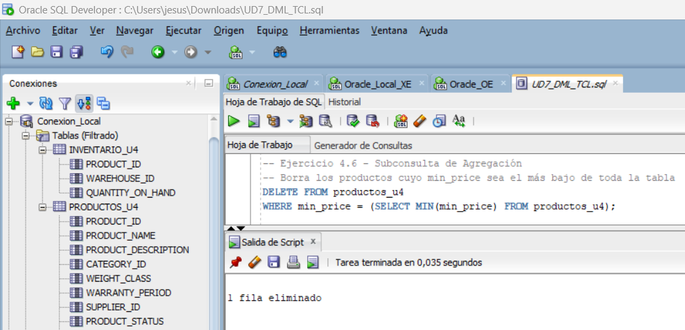


### 4.7 – Relacional

Borra productos que nunca han sido vendidos:

```sql
DELETE FROM productos_u4
WHERE product_id NOT IN (
    SELECT DISTINCT product_id FROM OE.ORDER_ITEMS
);
```

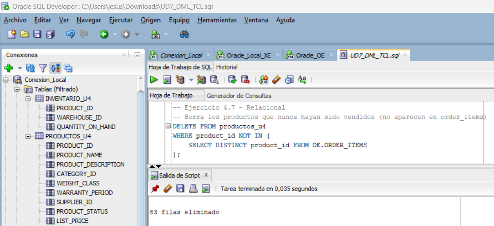


### 4.8 – Basado en Almacén

Borra registros de inventario en almacenes ubicados en Japón, usando un join de tres tablas:

```sql
DELETE FROM inventario_u4
WHERE warehouse_id IN (
    SELECT w.warehouse_id
    FROM OE.WAREHOUSES w
    JOIN OE.LOCATIONS l ON w.location_id = l.location_id
    JOIN OE.COUNTRIES c ON l.country_id  = c.country_id
    WHERE c.country_name = 'Japan'
);
```

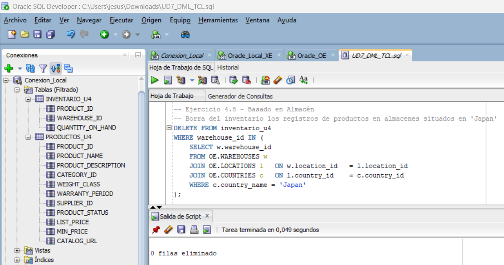


### 4.9 – Doble Condición Subquery

Borra productos cuya categoría tiene menos de 5 productos registrados:

```sql
DELETE FROM productos_u4
WHERE category_id IN (
    SELECT category_id
    FROM productos_u4
    GROUP BY category_id
    HAVING COUNT(*) < 5
);
```

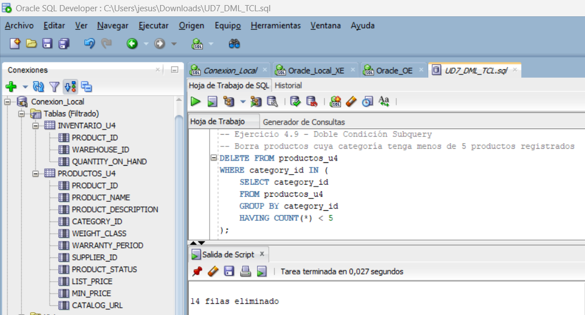


### 4.10 – Limpieza Total

Elimina todos los registros insertados durante la práctica (IDs 7000–8000):

```sql
DELETE FROM productos_u4
WHERE product_id BETWEEN 7000 AND 8000;
```

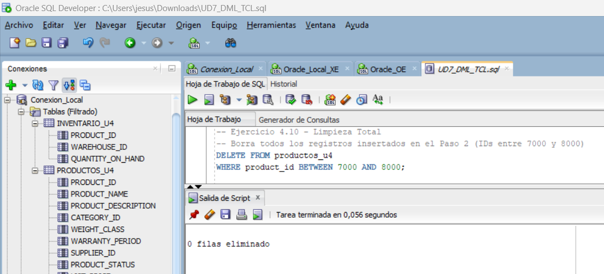

---


## Paso 5 – Transacciones y Concurrencia

Para estos ejercicios, utilizaremos una tabla limpia:

```sql
CREATE TABLE cuenta_bancaria (
    id NUMBER PRIMARY KEY,
    titular VARCHAR2(50),
    saldo NUMBER(10,2)
);

INSERT INTO cuenta_bancaria VALUES (1, 'Usuario A', 1000);
INSERT INTO cuenta_bancaria VALUES (2, 'Usuario B', 2000);
COMMIT;
```

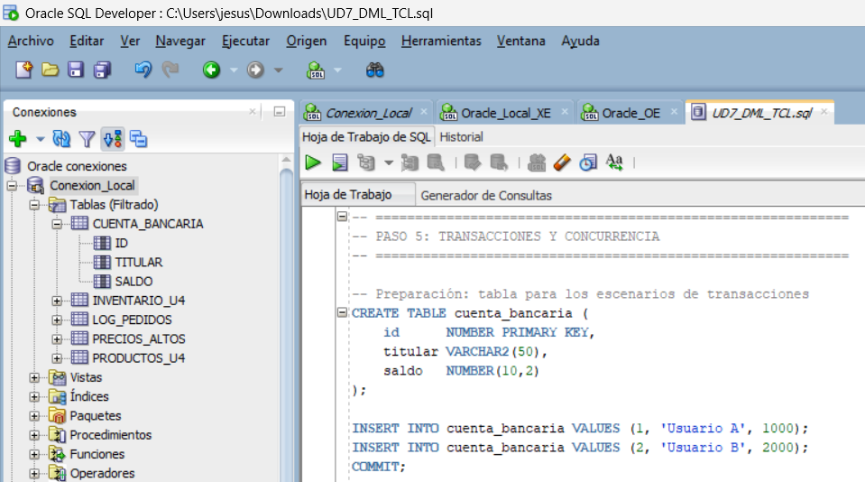


### Escenario 1 – Principio de Atomicidad (All-or-Nothing)

Se simula una transferencia bancaria que falla a mitad de proceso. Se restan 500 € de la cuenta 1, pero la cuenta de destino (ID 99) no existe.

```sql
UPDATE cuenta_bancaria SET saldo = saldo - 500 WHERE id = 1;
UPDATE cuenta_bancaria SET saldo = saldo + 500 WHERE id = 99;

SELECT * FROM cuenta_bancaria;

ROLLBACK;
```

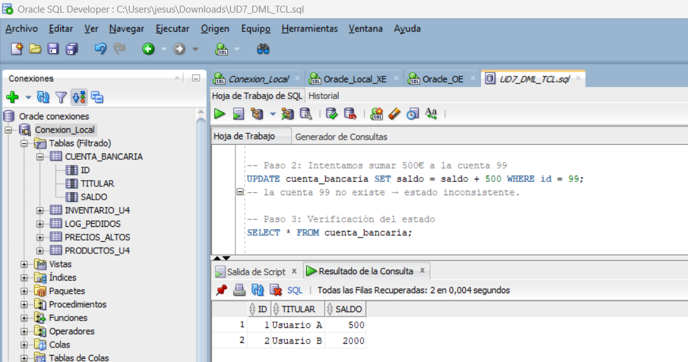

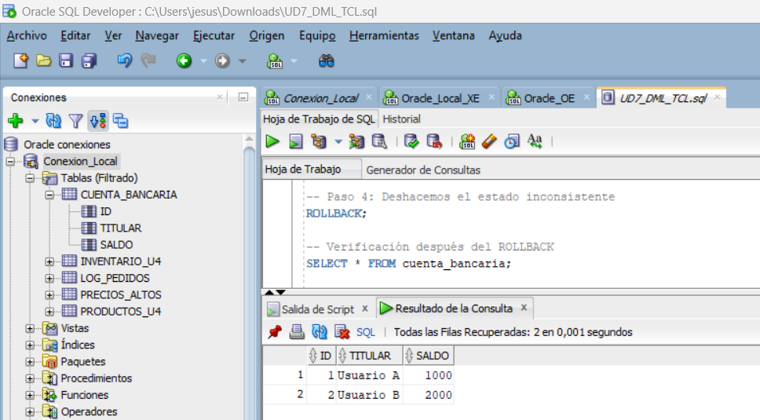


**Conclusión:** sin un bloque que finalice en `ROLLBACK` cuando algo falla, el dinero "desaparece" del sistema. Ambas operaciones deben tratarse como una única unidad atómica.


### Escenario 2 – Puntos de Guardado y Deshacer Parcial

Los `SAVEPOINT` permiten deshacer solo una parte de una transacción larga sin perder el trabajo anterior:

```sql
UPDATE cuenta_bancaria SET saldo = saldo * 1.10;
SAVEPOINT sp_subida;

INSERT INTO cuenta_bancaria VALUES (3, 'Usuario C', 500);
SAVEPOINT sp_nuevo_usuario;

DELETE FROM cuenta_bancaria;

ROLLBACK TO SAVEPOINT sp_nuevo_usuario; 

COMMIT;
```

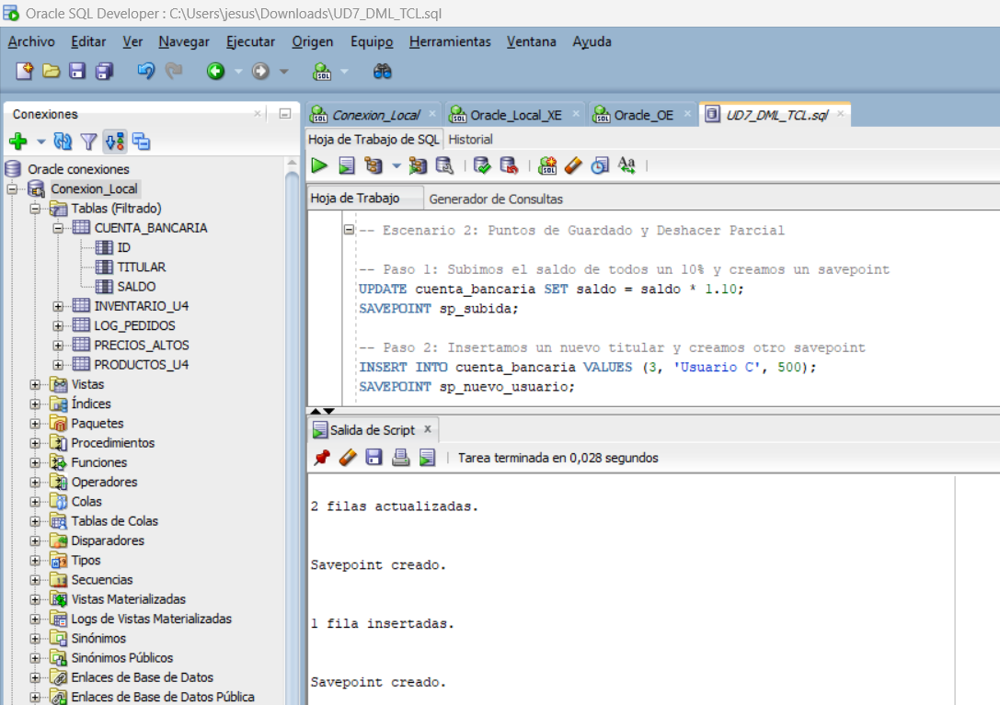

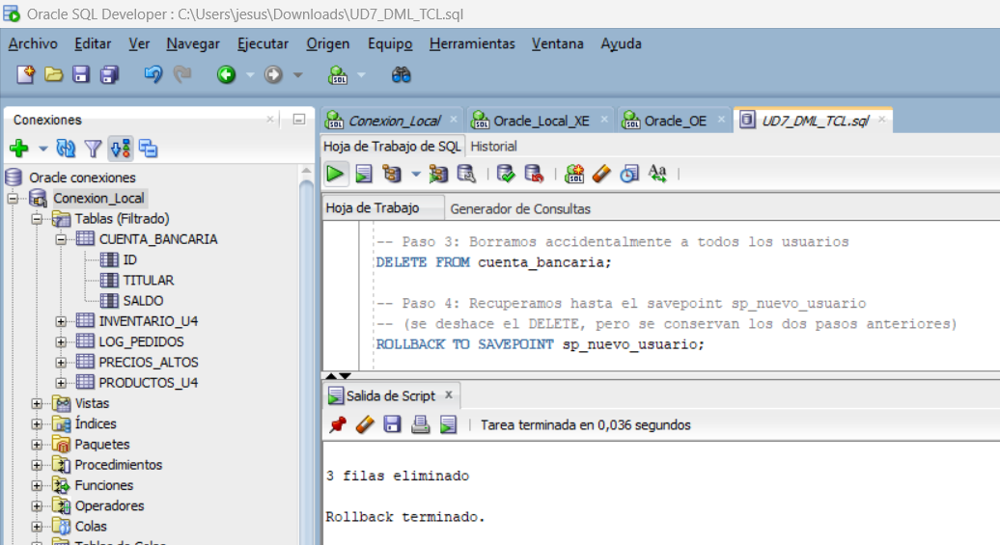

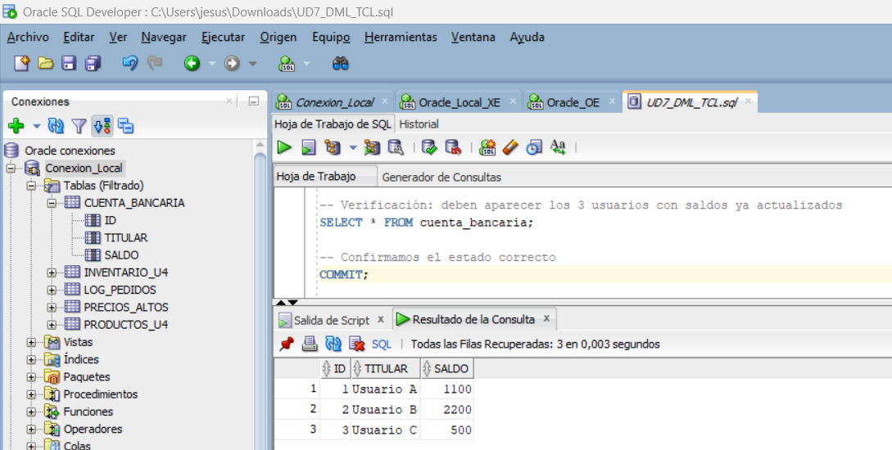


Tras el `ROLLBACK TO SAVEPOINT sp_nuevo_usuario`, los tres usuarios permanecen con sus saldos ya actualizados al 10%, y el borrado accidental queda revertido.


### Escenario 4 – El "Commit Fantasma" (DDL implica COMMIT)

En Oracle, cualquier sentencia **DDL** (`CREATE`, `DROP`, `ALTER`, `TRUNCATE`) ejecuta un **`COMMIT` implícito automático** antes de su ejecución.

```sql
DELETE FROM cuenta_bancaria WHERE id = 2;

CREATE TABLE log_errores (msg VARCHAR2(100));

ROLLBACK;

SELECT * FROM cuenta_bancaria;
```

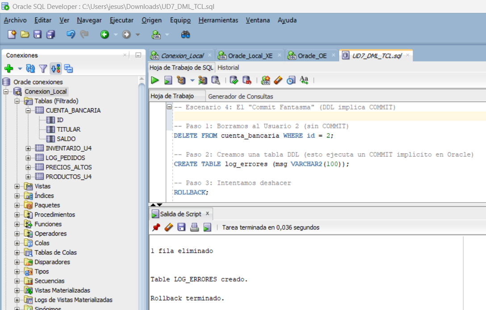

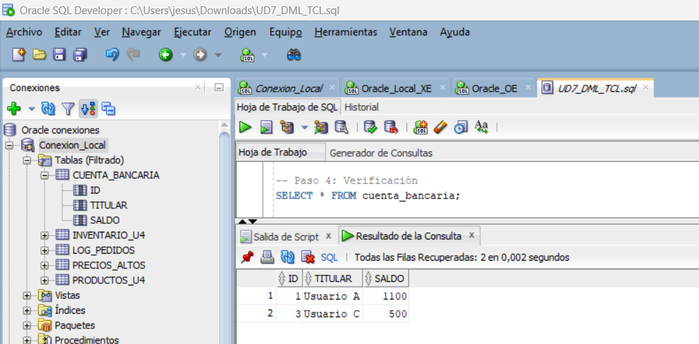

---
